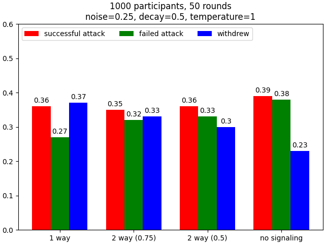
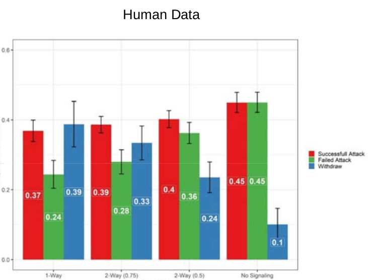

****************
Box game example
****************

In this section we describe an experiment involving the player having to make two different, though interrelated, decisions at each round.
This corresponds to some so far unpublished work in the DDMLab, a highly stylized example of a cyber defense task.

Description
-----------

In this game the player is given a choice of opening one of two boxes, 1 or 2, one of which contains a reward.
An automated defender is defending one of the boxes, but it can defend only one.
The player first chooses the box they are considering opening, but does not yet open it.
The player is then given feedback by the defender, potentially warning that the box is defended; however this warning may or may not be true.
The player then chooses whether or not to open the box. Opening an actually undefended box that contains the reward earns the player 100 points.
Opening a box that is truly defended costs the player 50 points.
Not opening a box, or opening a box that does not contain the reward has no effect on the player's score.

We consider four conditions for this task.
In each of these conditions there is a probability of 0.5 that the reward will be in box 1, and otherwise it will be in box 2.
In the first three conditions there is also a probability of 0.5 that a particular box is defended.
These three conditions differ in the probability of the user being *told* that the box is defended.

* In the "1 way" condition if the box is defended a warning signal is always given (this parameter is referred to as *p*, and in this case is thus 1);
  and if the box is not defended there is an 0.5 probability (this parameteer is referred to as *q*, and in this case is 0.5) that the warning
  signal is nonetheless given.

* In the "2 way (0.75)" condition if the box is defended the warning signal is issued 75% of the time (*p* = 0.75); and if the box
  is not defended it is issued 37.5% of the time (*q* = 0.375).

* In the "2 way (0.5) condition if the box is defended the warning signal is issued 50% of the time (*p* = 0.5); and if the box
  is not defended it is issued 25% of the time (*q* = 0.25).

The fourth condition is a degenerate "control" condition in which no warning signal is ever issued (referred to as the "no signaling" condition).

Code
----

The source file for this experiment and model can
:download:`be downloaded </_downloads/box-game.zip>`.
To run this install the dependencies from the ``requirements.txt`` file and then simply call Python on the ``box_game.py`` source file.
It will take few minutes to complete, and will then display a graph of the results, assuming ``matplotlib`` is correctly configured for your machine.

.. code-block:: python
    :linenos:

    # Copyright 2019–2025 Carnegie Mellon University
    # Example of a two stage decision task modeled using PyIBL.

    import click
    import csv
    from itertools import count
    import matplotlib.pyplot as plt
    import numpy as np
    import pyibl
    import random
    from tqdm import tqdm

    DEFAULT_ROUNDS = 50
    DEFAULT_PARTICIPANTS = 1000
    DEFAULT_NOISE = 0.25
    DEFAULT_DECAY = 0.5
    DEFAULT_TEMPERATURE = 1
    LOGFILE = "box-game-log.csv"

    CONDITIONS = [{"name": n, "p": p, "q": q} for n, p, q in [("1 way",        1,    0.5),
                                                              ("2 way (0.75)", 0.75, 0.375),
                                                              ("2 way (0.5)",  0.5,  0.25),
                                                              ("no signaling", None, None)]]

    def run(condition, rounds=DEFAULT_ROUNDS, participants=DEFAULT_PARTICIPANTS,
            noise=DEFAULT_NOISE, decay=DEFAULT_DECAY, temperature=DEFAULT_TEMPERATURE,
            logwriter=None, progress=None):
        for c in CONDITIONS:
            if c["name"] == condition:
                cond_p = c["p"]
                cond_q = c["q"]
                break
        else:
            raise ValueError(f"Unknown condition {condition}")
        selection_agent = pyibl.Agent(noise=noise, decay=decay, temperature=temperature)
        attack_agent = pyibl.Agent(attributes=(["attack"] + ([] if cond_p is None else ["warning"])),
                                   noise=noise, decay=decay, temperature=temperature)
        successful_attacks = 0
        failed_attacks = 0
        withdrawals = 0
        if cond_p is None:
            attack_agent.populate ([{"attack": False}],
                                   0)
        else:
            attack_agent.populate ([{"attack": False, "warning": 0},
                                    {"attack": False, "warning": 1}],
                                   0)
        for v in [100, -50]:
            selection_agent.populate([0, 1], v)
            if cond_p is None:
                attack_agent.populate([{"attack": True}],
                                      v)
            else:
                attack_agent.populate([{"attack": True, "warning": 0},
                                       {"attack": True, "warning": 1}],
                                      v)
        for p in range(participants):
            total = 0
            selection_agent.reset(True)
            attack_agent.reset(True)
            for r in range(rounds):
                selected = selection_agent.choose((0, 1))
                covered = random.random() < 0.5
                if cond_p is None:
                    attack = attack_agent.choose([{"attack": True},
                                                  {"attack": False}])["attack"]
                else:
                    if covered:
                        warned = int(random.random() < (1- cond_p))
                    else:
                        warned = int(random.random() < cond_q)
                    attack = attack_agent.choose([{"attack": True, "warning": warned},
                                                  {"attack": False, "warning": warned}])["attack"]
                if not attack:
                    withdrawals += 1
                    payoff = 0
                elif covered:
                    failed_attacks += 1
                    payoff = -50
                else:
                    successful_attacks += 1
                    payoff = 100
                total += payoff
                attack_agent.respond(payoff)
                selection_agent.respond(payoff)
                logwriter.writerow([condition, p + 1, r + 1, selected,
                                    (int(warned) if cond_p is not None else None),
                                    int(covered), int(attack), payoff, total])
            if progress:
                progress.update()
        return [n / (participants * rounds)
                for n in [successful_attacks, failed_attacks, withdrawals]]

    @click.command()
    @click.option("--rounds", "-r", default=DEFAULT_ROUNDS,
                  help="number of rounds to play")
    @click.option("--participants", "-p", default=DEFAULT_PARTICIPANTS,
                  help="number of virtual participants to simulate")
    @click.option("--noise", "-n", default=DEFAULT_NOISE,
                  help="noise for the two agents")
    @click.option("--decay", "-d", default=DEFAULT_DECAY,
                  help="decay parameter for the two agents")
    @click.option("--temperature", "-t", default=DEFAULT_TEMPERATURE,
                  help="blending temperature for the two agents")
    def main(rounds, participants, noise, decay, temperature):
        results = {"successful attack": [], "failed attack": [], "withdrew": []}
        colors = ("red", "green", "blue")
        with tqdm(total=(participants * len(CONDITIONS))) as p:
            with open(LOGFILE, "w", newline="") as f:
                w = csv.writer(f)
                w.writerow("Condition,Subject,Trial,Selected,Warning,Covered,Action,Outcome,Cum_Outcome".split(","))
                for c in CONDITIONS:
                    cname = c["name"]
                    r = run(cname, rounds=rounds, participants=participants,
                            noise=noise, decay=decay, temperature=temperature,
                            logwriter=w, progress=p)
                    for k, v in zip(results.keys(), r):
                        results[k].append(round(v, 2))
        fig, ax = plt.subplots(layout='constrained')
        x = np.arange(len(CONDITIONS))
        wid = 0.25
        for (kind, vals), mult, c  in zip(results.items(), count(), colors):
            offset = wid * mult
            rects = ax.bar(x + offset, vals, wid, label=kind, color=c)
            ax.bar_label(rects, padding=3)
            mult += 1
        ax.set_xticks(x + wid, [c["name"] for c in CONDITIONS])
        ax.legend(loc="upper left", ncols=3)
        ax.set_ylim(0, 0.6)
        ax.set_title(f"{participants} participants, {rounds} rounds\n"
                     f"noise={noise}, decay={decay}, temperature={temperature}")
        plt.show()

    if __name__ == "__main__":
        main()

The heart of the model is the ``run`` function, which runs the model for one condition, using a specified number of rounds and virtual participants,
as well as the usual IBL parameters. After working out the various parameters to implement the given condition,
it allocates two PyIBL Agents, one for selecting the box to possibly be attacked, and the second to decide whether or not to attack it.
Note that the attributes of the second, attack, Agent differ slightly for the "no signaling" condition, as we do not want to record
whether or not a warning that the box is defended was issued. These agents are prepopulated with instances for the various possible
combinations of whether or not a box is selected, and whether or not it is attacked when a warning has or has not been given,
with the prepopulated values being one each of the best and worst possible results.

The model then proceeds by at each round first selecting which box to possibly attack, and then, having seen whether or not a warning is given,
whether or not to attack. Once the resulting payoff is known both Agents are updated to reflect that payoff.

The ``main`` function calls ``run`` for each of the conditions, collects their results, and displays a bar graph comparing them.
The ``click`` module is used to provide the opportunity to run things with different numbers of rounds and participatns, as well as different
IBL parameters, though the default values of all are sensible.

Note that additional conditions can be easily added by amending the definition of the ``CONDITIONS`` constant.

Results
-------

Here is a graph of of the results when run with 1,000 participants and 50 rounds for each (the default values); note that when running
this yourself the results may differ slightly, since the model is, of course, stochastic, but the results should be similar:

The DDMLab has also run this task, with the same conditions, with an ensemble of human participants, with the following results:

