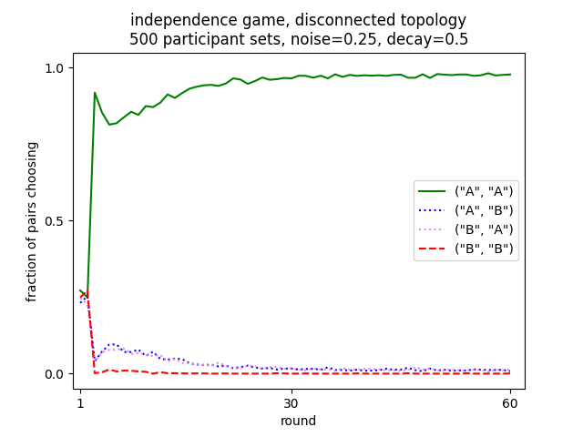

***************************
Multi-agent network example
***************************

In this example we describe an experiment to be modeled involving multiple agents interacting in constantly varying ways.
It is a coöperative binary choice game played by multiple players whose connectivity to one another varies,
in an effort to understand how their networks of interconnectedness facilitate or hinder their abilities to succeed at the game.
This closely follows some work described in Gonzalez *et al* (2025) [#f1]_.

Games
-----

The binary choice games are two from a spectrum of games described in Balliet *et al.* (2016) [#f2]_. The games in this spectrum are played between two players conventionally
referred to as Mary and John, exploring a taxonomy of dimensions of social interaction. For this example we use just two of the games at the extremes of one of the dimensions,
fully independent and fully interdependent.
In both games the players will each earn five points if they both "coöperate" by each picking A, and will each earn nothing if they
both "defect" by by each picking B. The difference is in the outcome if one picks A and the other B. In the independence game

each player receives the five point reward whenever they pick A, regardless of the other player's choice.
In the interdependence game

each player receives the five point reward whenever the *other* play picks A, regadless of this player's choice:

For this example each player makes their choices with no knowledge of the reward matrices, nor any knowledge of the other player's choices. All they know
if what they themselves choose, and what rewards they receive.

In a normally played single independence game of many rounds we might expect both players to quickly settle on choosing A since that always rewards them.
Naïvely we might similarly expect that in a similar version of the interdependence game for each player to essentially play randomly, since over the course
of a single choice which choice they made has no effect on their reward. However there is a deep subtlety to this game where without any explicit transfer
of information between the players, over the course of several moves they will be driven to both pick A. This is driven by a natural weighting of
recent results over earlier ones, resulting in a roughly win-stay/lose-shift strategy, which curiously over a two move sequence can drive the players
to coöperate.

Networks
--------

For this example we are interested not in normal play between just two players, but rather small networks of players interacting with different players, and how this
may modify the choices made. The networks chosen for this example are inspired by those used for a somewhat different task in Mason *et al.* (2008) [#f3]_ and Sloman *et al.* (2021) [#f4]_.
For this example we use three different networks, each with six nodes.

.. image:: _static/networks.png
   :align: center

When we play the game at each round we will randomly select three, non-overlapping  pairs of nodes, such that each node in a pair is connected in the network to the other
node of that pair.
Note that in the disconnected network each node is always paired with the same other node; in the ring network there are only two possible ways pairs of nodes can be connected; and
in the fully connected case there are fifteen different ways the pairs of nodes can be selected. Where there are multiple ways to select pairs of nodes, at each round we randomly
select a different way of pairing them, so, except in the disconnected case, at each round a node may play a different partner than it did in the previous or succeeding round.

Games and networks definitions
------------------------------

The Python code for defining the two games to be played is a dict mapping the names of the two games to further dicts mapping a tuple of the possible choices
by the two players to a tuple of the outcomes for those two players.

.. code-block:: python

    GAMES = {"independence": {("A", "A"): (5, 5),
                              ("A", "B"): (5, 0),
                              ("B", "A"): (0, 5),
                              ("B", "B"): (0, 0)},
             "interdependence": {("A", "A"): (5, 5),
                                 ("A", "B"): (0, 5),
                                 ("B", "A"): (5, 0),
                                 ("B", "B"): (0, 0)}}

The code for defining the three networks to be used is a dict mapping the names of the three networks to lists of sublists, each sublist containing three 2-tuples.
These sublists enumerate each of the possible ways the various nodes can be connected.

.. code-block:: python

    PAIRINGS = {
        "disconnected": [[(0, 1), (2, 3), (4, 5)]],
        "ring": [[(0, 1), (2, 3), (4,5)],
                 [(1, 2), (3, 4), (0, 5)]],
        "fully-connected": [[(4, 5), (2, 3), (0, 1)],
                            [(3, 5), (2, 4), (0, 1)],
                            [(3, 4), (2, 5), (0, 1)],
                            [(4, 5), (1, 3), (0, 2)],
                            [(3, 5), (1, 4), (0, 2)],
                            [(3, 4), (1, 5), (0, 2)],
                            [(4, 5), (1, 2), (0, 3)],
                            [(2, 5), (1, 4), (0, 3)],
                            [(2, 4), (1, 5), (0, 3)],
                            [(3, 5), (1, 2), (0, 4)],
                            [(2, 5), (1, 3), (0, 4)],
                            [(2, 3), (1, 5), (0, 4)],
                            [(3, 4), (1, 2), (0, 5)],
                            [(2, 4), (1, 3), (0, 5)],
                            [(2, 3), (1, 4), (0, 5)]]}

From this dict we further compute constants describing the number of pairs to be played at each round, and the number of total nodes.

.. code-block:: python

    PAIRS = len(list(PAIRINGS.values())[0][0])
    for kind in PAIRINGS.values():
        for pairing in kind:
            assert len(pairing) == PAIRS
    NODES = 2 * PAIRS

For these networks the constant ``PAIRS`` is always ``3`` and the constant ``NODES`` is always ``6``.

The model
---------

For the model we create a PyIBL ``Agent`` for each of the nodes.

.. code-block:: python

    PREPOPULATED_VALUE = 6
    ...
    agents = [Agent(str(i), default_utility=PREPOPULATED_VALUE)
              for i in range(1, NODES + 1)]

Note that the prepopulated value is chosen as 1.2 times the maximum possible payoff of 5 to facilitate early exploration.

To run the model we define a function ``run_one()`` which takes as parameters
#. the list of agents defined above
#. the name of the network to use
#. the name of the game to play
#. the number of sets of participants to simulate playing the game
#. the number of rounds to place for each simulated set of participants
#. a ``tqdm`` progress indicator to update after the simulation of each set of participants is completed
#. a ``CSVWriter`` object into which to write details of each round
#. and the name of a file into which to draw a plot of the results, or ``None`` simply show them on terminal as ``run_one()`` finishes.

.. code-block:: python

    def run_one(agents, network, game, participant_sets, rounds, progress, csv_writer, plot_file):
        counts = [Counter() for i in range(rounds)]
        for pp in range(participant_sets):
            for a in agents:
                a.reset()
            for r in range(rounds):
                for p in random.choice(PAIRINGS[network]):
                    p = random.sample(p, k=len(p)) # counterbalance
                    choices = tuple(agents[i].choose("AB") for i in p)
                    counts[r].update((choices,))
                    payoffs = GAMES[game][choices]
                    for i, j in zip(p, count()):
                        agents[i].respond(payoffs[j])
                    csv_writer.writerow((network, game, pp + 1, r + 1,
                                         p[0], choices[0], payoffs[0],
                                         p[1], choices[1], payoffs[1]))
                progress.update()

We create ``Counter`` object to capture the number of times each possible pair of choices is made at each round.
We then iterate through the required number of sets of participants, first resetting all the agents.
The for each round we randomly pick one of the pairings of participants as described by the netword; for the disconnected network
this is always a fixed set of pairings, for the ring one of two possibiliites, and for the fully connected network
one of fifteen.
We iterate through the three pairs in the chosen pairings and play one game, having each of the two agents selected make a choice,
computing their payoffs, and responding to the agents with those payoffs, and finally record what we have done to the ``CSVWriter``.
After all the rounds are finished we update the progress indicator.

At this point all the data for this network and game combination is generated and gathered, and we can plot the results

.. code-block:: python

    plt.plot(tuple(range(1, rounds + 1)),
             tuple(counts[r][("A", "A")] / (participant_sets * PAIRS) for r in range(rounds)),
             label='("A", "A")', color="green", linestyle="solid")
    plt.plot(tuple(range(1, rounds + 1)),
             tuple(counts[r][("A", "B")] / (participant_sets * PAIRS)  for r in range(rounds)),
             label='("A", "B")', color="blue", linestyle="dotted")
    plt.plot(tuple(range(1, rounds + 1)),
             tuple(counts[r][("B", "A")] / (participant_sets * PAIRS)  for r in range(rounds)),
             label='("B", "A")', color="violet", linestyle="dotted")
    plt.plot(tuple(range(1, rounds + 1)),
             tuple(counts[r][("B", "B")] / (participant_sets * PAIRS)  for r in range(rounds)),
             label='("B", "B")', color="red", linestyle="dashed")
    plt.legend()
    plt.title(f"{game} game, {network} topology\n"
              f"{participant_sets} participant sets, noise={agents[0].noise}, decay={agents[0].decay}")
    plt.xlim((0, rounds + 2))
    plt.xticks((1, rounds / 2, rounds))
    plt.xlabel("round")
    plt.ylim((-0.05, 1.05))
    plt.yticks((0, 0.5, 1))
    plt.ylabel("fraction of pairs choosing")
    if plot_file:
        plt.savefig(plot_file)
    else:
        plt.show()
    plt.clf()

Note that we plot one line for each of the four possible pairs of choices, showing the fraction of times that choice was made.

All that is left to do is iterate through the two games and three networks and call the ``run_one()`` function.
This main function uses ``click`` to parse a few command line arguments allowing the number of sets of participants,
number of rounds played by each, and noise and decay parameters of the agents to be set, though with sensible defaults
if none are explicitly specified.
This function also opens and closes the file into which the CSV data will be written, as well as creating the progress indicator.

.. code-block:: python

    @click.command()
    @click.option("--rounds", "-r", default=DEFAULT_ROUNDS, type=int,
                  help="The number of rounds to play")
    @click.option("--participant-sets", "-p", default=DEFAULT_PARTICIPANT_SETS, type=int,
                  help="The number of participant sets to simulate")
    @click.option("-noise", "-s", default=DEFAULT_NOISE, type=float,
                  help="The IBL activation noise to use")
    @click.option("--decay", "-d", default=DEFAULT_DECAY, type=float,
                  help="The IBL decay parameter to use")
    def main(rounds, participant_sets, noise, decay):
        with open("results.csv", "w", newline="") as f:
            w = csv.writer(f)
            w.writerow(("network,game,participant set,round,"
                        "player one,player one move,player one payoff,"
                        "player two,player two move,player two payoff").split(","))
            agents = [Agent(str(i), default_utility=PREPOPULATED_VALUE, noise=noise, decay=decay)
                      for i in range(1, NODES + 1)]
            with tqdm(total=(len(GAMES) * len(PAIRINGS) * participant_sets * rounds)) as t:
                for n in PAIRINGS.keys():
                    for g in GAMES.keys():
                        run_one(agents, n, g, participant_sets, rounds,
                                t, w, f"{n}-{g}.png")

    if __name__ == '__main__':
        main()

The entire file can
:download:be downloaded </_downloads/multi-agent-network.zip>`

.. code-block:: python
    :linenos:

    # Copyright 2025 Carnegie Mellon University
    # Example of networked binary choice games implemented with PyIBL

    import click
    from collections import Counter
    import csv
    from datetime import datetime
    from itertools import count
    import matplotlib.pyplot as plt
    from pyibl import Agent
    import random
    from tqdm import tqdm

    DEFAULT_ROUNDS = 60
    DEFAULT_PARTICIPANT_SETS = 500

    DEFAULT_NOISE = 0.25
    DEFAULT_DECAY = 0.5

    GAMES = {"independence": {("A", "A"): (5, 5),
                              ("A", "B"): (5, 0),
                              ("B", "A"): (0, 5),
                              ("B", "B"): (0, 0)},
             "interdependence": {("A", "A"): (5, 5),
                                 ("A", "B"): (0, 5),
                                 ("B", "A"): (5, 0),
                                 ("B", "B"): (0, 0)}}

    PREPOPULATED_VALUE = 6

    PAIRINGS = {
        "disconnected": [[(0, 1), (2, 3), (4, 5)]],
        "ring": [[(0, 1), (2, 3), (4,5)],
                 [(1, 2), (3, 4), (0, 5)]],
        "fully-connected": [[(4, 5), (2, 3), (0, 1)],
                            [(3, 5), (2, 4), (0, 1)],
                            [(3, 4), (2, 5), (0, 1)],
                            [(4, 5), (1, 3), (0, 2)],
                            [(3, 5), (1, 4), (0, 2)],
                            [(3, 4), (1, 5), (0, 2)],
                            [(4, 5), (1, 2), (0, 3)],
                            [(2, 5), (1, 4), (0, 3)],
                            [(2, 4), (1, 5), (0, 3)],
                            [(3, 5), (1, 2), (0, 4)],
                            [(2, 5), (1, 3), (0, 4)],
                            [(2, 3), (1, 5), (0, 4)],
                            [(3, 4), (1, 2), (0, 5)],
                            [(2, 4), (1, 3), (0, 5)],
                            [(2, 3), (1, 4), (0, 5)]]}

    PAIRS = len(list(PAIRINGS.values())[0][0])
    for kind in PAIRINGS.values():
        for pairing in kind:
            assert len(pairing) == PAIRS
    NODES = 2 * PAIRS

    def run_one(agents, network, game, participant_sets, rounds, progress, csv_writer, plot_file):
        counts = [Counter() for i in range(rounds)]
        for pp in range(participant_sets):
            for a in agents:
                a.reset()
            for r in range(rounds):
                for p in random.choice(PAIRINGS[network]):
                    p = random.sample(p, k=len(p)) # counterbalance
                    choices = tuple(agents[i].choose("AB") for i in p)
                    counts[r].update((choices,))
                    payoffs = GAMES[game][choices]
                    for i, j in zip(p, count()):
                        agents[i].respond(payoffs[j])
                    csv_writer.writerow((network, game, pp + 1, r + 1,
                                         p[0], choices[0], payoffs[0],
                                         p[1], choices[1], payoffs[1]))
                progress.update()
        plt.plot(tuple(range(1, rounds + 1)),
                 tuple(counts[r][("A", "A")] / (participant_sets * PAIRS) for r in range(rounds)),
                 label='("A", "A")', color="green", linestyle="solid")
        plt.plot(tuple(range(1, rounds + 1)),
                 tuple(counts[r][("A", "B")] / (participant_sets * PAIRS)  for r in range(rounds)),
                 label='("A", "B")', color="blue", linestyle="dotted")
        plt.plot(tuple(range(1, rounds + 1)),
                 tuple(counts[r][("B", "A")] / (participant_sets * PAIRS)  for r in range(rounds)),
                 label='("B", "A")', color="violet", linestyle="dotted")
        plt.plot(tuple(range(1, rounds + 1)),
                 tuple(counts[r][("B", "B")] / (participant_sets * PAIRS)  for r in range(rounds)),
                 label='("B", "B")', color="red", linestyle="dashed")
        plt.legend()
        plt.title(f"{game} game, {network} topology\n"
                  f"{participant_sets} participant sets, noise={agents[0].noise}, decay={agents[0].decay}")
        plt.xlim((0, rounds + 2))
        plt.xticks((1, rounds / 2, rounds))
        plt.xlabel("round")
        plt.ylim((-0.05, 1.05))
        plt.yticks((0, 0.5, 1))
        plt.ylabel("fraction of pairs choosing")
        if plot_file:
            plt.savefig(plot_file)
        else:
            plt.show()
        plt.clf()

    @click.command()
    @click.option("--rounds", "-r", default=DEFAULT_ROUNDS, type=int,
                  help="The number of rounds to play")
    @click.option("--participant-sets", "-p", default=DEFAULT_PARTICIPANT_SETS, type=int,
                  help="The number of participant sets to simulate")
    @click.option("-noise", "-s", default=DEFAULT_NOISE, type=float,
                  help="The IBL activation noise to use")
    @click.option("--decay", "-d", default=DEFAULT_DECAY, type=float,
                  help="The IBL decay parameter to use")
    def main(rounds, participant_sets, noise, decay):
        with open("results.csv", "w", newline="") as f:
            w = csv.writer(f)
            w.writerow(("network,game,participant set,round,"
                        "player one,player one move,player one payoff,"
                        "player two,player two move,player two payoff").split(","))
            agents = [Agent(str(i), default_utility=PREPOPULATED_VALUE, noise=noise, decay=decay)
                      for i in range(1, NODES + 1)]
            with tqdm(total=(len(GAMES) * len(PAIRINGS) * participant_sets * rounds)) as t:
                for n in PAIRINGS.keys():
                    for g in GAMES.keys():
                        run_one(agents, n, g, participant_sets, rounds,
                                t, w, f"{n}-{g}.png")

    if __name__ == '__main__':
        main()

Results
-------

Running the interdependence game in the disconnected network we see that each, fixed pair fairly quickly settles on mutual coöperation (both players selecting A)

.. image:: _static/disconnected-interdependence.png

But as the number of connections is increased, with various pairs intermixed, it becomes harder for the players to settle on the optimal play

.. image:: _static/ring-interdependence.png

Running the independence game again players quickly settle on optimal play. But, since they don't depend upon their partners' moves in any way, as the number
of interconnections in the network increases this behavior does not degrade

.. image:: _static/ring-independence.png

.. image:: _static/fully-connected-independence.png

.. [#f1] Gonzalez, Cleotilde, Palvi Aggarwal, and Donald Morrison.
         "Emergent Group Learning from individual experiential choice: Interdependence, Aggregation and Strategy"
         In preparation.

.. [#f2] Balliet, Daniel, Joshua M. Tybur, and Paul A. M. Van Lange.
         Function Interdependecne Theory: An Evolutionary Account of Social
         Situations. *Personality and Social Psychology Review* Vol. 21 No. 4;
         DOI: 10.1177/1088868316657965 (2016)

.. [#f3] Mason, Winter A., Andy Jones, and Robert L Goldstone.
         Propagation of Innovations in Networked Groups.
         *Journal of Experimental Psychology: General* Vol. 137 No. 3, 442--433;
         DOI: 10.1037/a0012798 (2008).

.. [#f4] Sloiman, Sabina J., Robert L Goldstone, and Cleotilde Gonzalez.
         A Social Interpolation Model of Group Problem-Solving.
         *Cognitive Science* Vol. 45 No. 12; DOI: 10.1111/cogs.13066 (2021).
